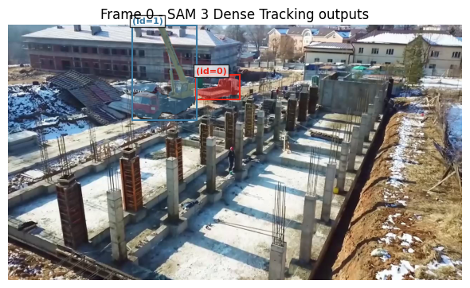
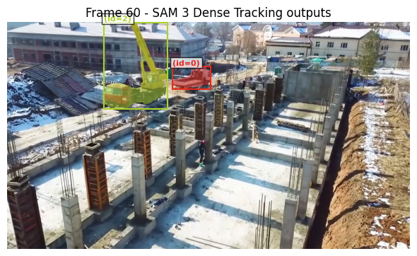
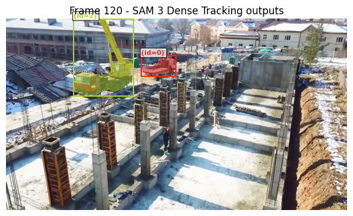

# Video Object Segmentation & Tracking (SAM3)

End-to-end pipeline for video object segmentation and tracking with  
mask propagation across time using **Segment Anything Model v3 (SAM3)**.  

Interactive visualization of segmentation masks, bounding boxes, and object IDs.  


## Key Features

- Video segmentation using text prompts (people, vehicles, license plates)  
- Mask propagation over time for stable tracking  
- Multi-class segmentation via independent model passes  
- Custom visualization module for masks, bounding boxes, and object IDs  
- Export of intermediate frames and final videos  


## Tech Stack

- Python  
- PyTorch  
- CUDA  
- OpenCV  
- NumPy  
- SAM3  


## Workflow

1. **Video Input & Preprocessing**  
   - Load video, sample frames.  
   - Optional resizing, normalization.  

2. **Segmentation & Tracking**  
   - Apply SAM3 per frame using text prompts.  
   - Propagate masks over time for temporal consistency.  
   - Assign object IDs for tracking across frames.  

3. **Visualization & Export**  
   - Render segmentation masks on video frames.  
   - Display bounding boxes and IDs.  
   - Save as final video, GIF, or sequence of images.  


## Example Results

### Frame Snapshots
<h4 align="center">Frame Snapshots</h4>
<p align="center">
  
  
  
</p>


### GIF Demo
<h4 align="center">Demonstrates mask propagation and tracking across frames.</h4>
<p align="center">
  
</p>


## Custom Visualization Module
The repository includes a visualization module that:  

- Overlays masks, bounding boxes, and object IDs on each frame  
- Supports exporting frames, GIFs, or a final rendered video  
- Allows adjustment of colors, transparency, and tracking styles  


## Project Structure
```
video-object-segmentation-sam3/
│
├─ data/            # input videos and intermediate outputs (ignored in repo)
├─ notebookfiles/   # Jupyter notebook demonstrating the pipeline
├─ scripts/         # segmentation and visualization scripts
├─ video_outputs/   # final segmented video
├─ sam3/            # external SAM3 repository (see Installation)
├─ requirements.txt
└─ README.md
```


## Installation
```bash
git clone https://github.com/your_username/video-object-segmentation-sam3.git
cd video-object-segmentation-sam3
git clone https://github.com/facebookresearch/sam3
pip install -r requirements.txt
```


## Usage

- **Notebook demo:** `notebookfiles/video_segmentation.ipynb` — single-class segmentation, intermediate frames saving.  
- **Visualization script:** `scripts/put_masks_on_video.py` — combine segmentation outputs and render final video/GIF with masks, bounding boxes, and object IDs.  
